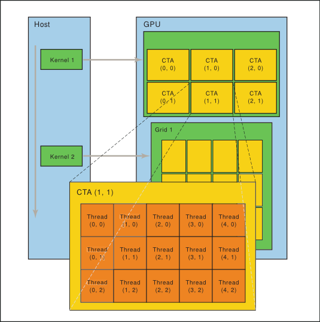
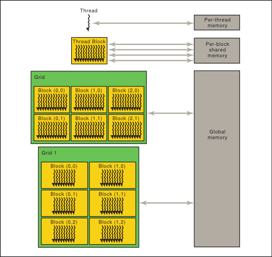

# GPGPU[^gpgpu]

[^gpgpu]: *General-purpose computing on Graphics Processing Unit*

## Les processeurs graphiques, ces accélérateurs matériels un peu particuliers

Avec l'apparition d'expériences multimédia dans l'informatique, qu'il s'agisse simplement de décodage de flux vidéo numérique, ou de rendu en temps réel de jeux vidéos, on a constaté l'apparition de processeurs graphiques dédiés chez plusieurs constructeurs dans les années 80.

Ces processeurs n'ont cessé d'évoluer et de se démocratiser depuis.
Tout *smartphone*, ordinateur moderne possède aujourd'hui un processeur traditionnel et un circuit graphique, que ce soit sous la forme de circuit intégré au processeur, ou sous la forme d'une puce dédiée.

---

Une particularité dans les opérations nécessaire pour la manipulation et le rendu graphique, c'est la nécessité de pouvoir effectuer une même opération à un ensemble important de données.
Par exemple, la transformation (rotation, translation, mise à l'échelle, …) d'un objet 3D se traduit par la multiplication des coordonnées de tous les points de cet objet par une même matrice.

De même, la plupart de ces opérations peuvent être faites en parallèle.
La translation d'un objet peut être calculée en même temps que la rotation d'un autre, sans que les résultats des opérations soient interdépendants.

Bien que des extensions ont été ajoutés à l'architecture x86 au fil du temps pour permettre par exemple les opérations SIMD[^simd], les processeurs traditionnels restent relativement inefficaces quand il s'agit d'effectuer des opérations simples sur de gros ensemble de données.

[^simd]: *Single Instruction Multiple Data* – permet d'effectuer la même opération mathématique sur plusieurs vecteurs de données.

Les processeurs graphiques ont ainsi été conçus dans cette optique.
À la place des quelques cœurs complexes que l'on retrouve dans un CPU se trouvent quelques centaines d'unités d'exécutions dans un GPU.


## Détourner l'utilisation des GPUs

Au début des années 2000, la plupart des cartes graphiques grand publiques se programmaient via différentes APIs[^api] comme OpenGL (du groupe Khronos) ou DirectX (de Microsoft).
À cette époque, les GPUs pouvaient essentiellement travailler sur des matrices de couleurs (donc des images bitmap).
Mais les chercheurs ont rapidement observés que ces données d'entrée –initialement des couleurs– pouvaient représenter virtuellement n'importe quelle donnée numérique[@Sanders:2010:CEI:1891996].
Les chercheurs ont alors essayé de détourner ces APIs pour utiliser la puissance du circuit graphique pour effectuer des calculs sur des données autre que des resources graphiques.

[^api]: *Application Programming Interface*

En réponse à cette demande, *Nvidia* lance en 2006 leur première carte graphique avec une architecture CUDA.
Cette architecture introduit un certain nombre de fonctionnalités qui manquait jusqu'alors pour permettre le calcul sur *GPU*.

*Nvidia* introduit également l'API *CUDA* permettant d'utiliser les centaines d'unités d'arithmétiques et de logiques du GPU directement, sans détourner l'API OpenGL.


## Programmer sur GPU

À haut niveau, CUDA offre un langage de programmation `CUDA C`, qui est un dérivé du C, avec des extensions permettant l'exécution de code massivement parallèle sur GPU.

Dans un même fichier source, on va retrouver du code exécuté par l'hôte[^host] et le noyau[^kernel] exécuté par le GPU[^device].

### Exemple de code CUDA

Ci-dessous est un exemple volontairement très simple (et simplifié par rapport au code réellement nécessaire) de code CUDA.

```c
#define N   1000

__global__ void add(int *a, int *b, int *c) {
    int tid = blockIdx.x;
    if (tid < N)
        c[tid] = a[tid] + b[tid];
}
```

L'identifiant `__global__` indique que ce code sera exécuté sur GPU, et appelé depuis le code hôte.
Les "globales" telles que `blockIdx` permettent de savoir sur quel bloc est exécuté le code, et ainsi agir sur les bons éléments des tableaux.

------

```c
int main(void) {
    int a[N], b[N], c[N];
    int *dev_a, *dev_b, *dev_c;

    cudaMalloc((void**)&dev_a, N * sizeof(int));
    cudaMalloc((void**)&dev_b, N * sizeof(int));
    cudaMalloc((void**)&dev_c, N * sizeof(int));

    for (int i=0; i<N; i++) {
        a[i] = -i;
        b[i] = i * i;
    }

    cudaMemcpy(dev_a, a, N * sizeof(int),
               cudaMemcpyHostToDevice);
    cudaMemcpy(dev_b, b, N * sizeof(int),
               cudaMemcpyHostToDevice);

    // ...
}
```

Côté hôte, les trois tableaux de données (les deux tableaux à additionner, ainsi que le tableau qui contiendra le résultat) est alloué à la fois côté hôte et côté GPU.

Les tableaux sont remplis avec quelques données côté hôte, puis copiés vers le GPU.

------

```c
int main(void) {
    // ...

    add<<<N,1>>>(dev_a, dev_b, dev_c);

    cudaMemcpy(c, dev_c, N * sizeof(int),
               cudaMemcpyDeviceToHost);

    for (int i=0; i<N; i++)
        printf("%d + %d = %d\n", a[i], b[i], c[i]);

    cudaFree(dev_a);
    cudaFree(dev_b);
    cudaFree(dev_c);
}
```

Le noyau est lancé `N` fois, et le résultat dans le tableau `c` est copié du GPU vers l'hôte.
Le résultat est ensuite affiché, et les tableaux libérés de la mémoire.

---

### Terminologie & hiérarchie



Un GPU est ainsi composé d'une (ou plusieurs) grille(s).
Chaque grille est composée de plusieurs “cooperative thread array” (CTA) qui sont composés de plusieurs *blocs* de *threads* d'exécution.

Les différents CTA vont pouvoir exécuter plusieurs noyaux indépendamment.

Chaque niveau d'abstraction a accès à différents niveaux de mémoire partagée, et impose un certain niveau de synchronisation entre les threads.
De manière générale, plus on agit profondément dans la hiérarchie, plus l'exécution doit être synchronisée entre les thread (au niveau des branchements, par exemple) et plus l'accès à un certain niveau de mémoire partagée est rapide.



## Compilation et exécution d'un noyau

Nvidia fournit `nvcc` comme outil de haut niveau pour simplifier le développement pour CUDA.

Cet outil concrètement va:

 - Extraire le(s) noyau(x) à exécuter sur GPU
   - Le transformer en sorte d'assembleur appelé PTX
   - Compiler cet assembleur en code objet pour la carte installée sur la machine
 - Extraire le code C à exécuter sur la machine
   - Remplacer les lancements de noyaux par des appels à la bibliothèque `cudart`[^cudart]
   - Compiler en un exécutable, en liant `cudart`

Il est également possible de demander à `nvcc` de seulement générer le code *PTX*, et ce code sera compilé à l'exécution par `cudart`.

*Parallel Thread Execution* (PTX) est à la fois le nom de la machine virtuelle dans lequel est exécuté l'application côté GPU, et le jeu d'instruction de CUDA.

Les programmes PTX ressemblent à des programmes en assembleur, mais avec un jeu d'instruction spécifique à CUDA.
Ce jeu d'instruction est décrit dans un document fournit par Nvidia\cite{ptx-cuda}.


[^host]: *host*, terme pour désigner le processeur dans la terminologie *CUDA*
[^kernel]: *kernel*, terme pour désigner un code exécuté sur GPU
[^device]: *device* dans la terminologie CUDA
[^cudart]: *CUDA Runtime*

## Architecture matérielle d'un GPU
